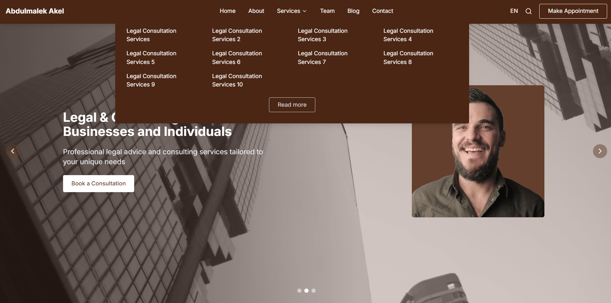

<p align="center">
  
  
</p>
<p align="center">
  
  
</p>
<p align="center">
  
  
</p>
<p align="center">
  
  
</p>
<p align="center">
  
  
</p>
<p align="center">
  
  
</p>
<p align="center">
  
  
</p>
<p align="center">
  
  
</p>
<p align="center">
  
  
</p>
<p align="center">
  
  
</p>

# Next_StrapiCMS_Stack

A full-stack monorepo combining:

- **Frontend**: `FE_NEXT` – A Next.js application with multilingual support, rich UI, and dynamic routes.
- **Backend**: `BE_STRAPI_CMS` – A powerful Strapi CMS for managing content via REST or GraphQL.

---

## 📁 Project Structure
TAKAMUL_FULL_STACK/
├── FE_NEXT/ # Frontend - Next.js 13+ with App Router
└── BE_STRAPI_CMS/ # Backend - Strapi CMS (v4+)

---

## 🚀 Getting Started

### Prerequisites

- Node.js `v18+`
- Yarn or npm
- Docker (optional)
- Git

---

### 1. Clone the repository

```bash
git clone https://github.com/Mlook70/Next_StrapiCMS_Stack.git
cd Next_StrapiCMS_Stack

2. Install dependencies
Frontend
cd FE_NEXT
npm install
# or
yarn install

Backend
cd ../BE_STRAPI_CMS
npm install
# or
yarn install
______________________________________________________________________
🧩 Features
🌐 Multilingual with next-intl + Strapi i18n plugin

🧠 Dynamic routing & content pulling via REST API

🎯 Fully searchable services & team members

🎨 Modern UI with RTL support

🔒 Secure Strapi admin & API tokens

🧾 Custom content types: Services, Teams, etc.
